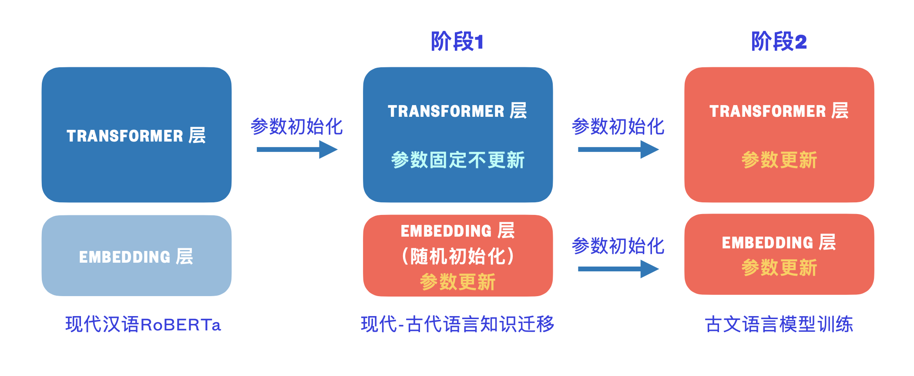

[**中文说明**](https://github.com/ethan-yt/guwenbert/) | [English](https://github.com/ethan-yt/guwenbert/blob/master/README_EN.md)

<p align="center">
    <br>
    
    <br>
</p>
<p align="center">
<a href="https://github.com/ethan-yt/guwenbert/issues"></a>
<a href="https://github.com/ethan-yt/guwenbert/stargazers"></a>
<a href="https://github.com/Ethan-yt/guwenbert/blob/main/LICENSE"></a>
</p>

`GuwenBERT`是一个基于大量古文语料的`RoBERTa`模型。

在自然语言处理领域中，预训练语言模型（Pre-trained Language Models）已成为非常重要的基础技术。
目前互联网上存在大量的现代汉语BERT模型可供下载，但是缺少古文的语言模型。
为了进一步促进古文研究和自然语言处理的结合，我们发布了古文预训练模型`GuwenBERT`。

对于古文的常见任务：断句，标点，专名标注，目前通常采用序列标注模型。这类模型非常依赖预训练的词向量或者BERT，所以一个好的语言模型可以大幅提高标注效果。经过实验，在古文NER任务中我们的BERT比目前最流行的中文RoBERTa效果**提升6.3%**，仅仅300步就可以达到中文RoBERTa的最终水平，特别适合**标注语料不足的小数据集**。使用我们的模型也可以**减少数据清洗，数据增强，引入字典等繁琐工序**，在评测中我们仅仅用了一个BERT+CRF的模型就可以达到第二名。

* `GuwenBERT`基于`殆知阁古代文献`语料训练，其中包含15,694本古文书籍，字符数1.7B。所有繁体字均经过简体转换处理。

* `GuwenBERT`的词表是基于古文语料构建的，取其中高频字符，大小为23,292。

* 基于继续训练技术（Continue Training），`GuwenBERT`结合现代汉语RoBERTa权重和大量古文语料，将现代汉语的部分语言特征向古代汉语迁移以提升表现。

## 相关项目

* [CCLUE](https://cclue.top): 古文语言理解测评基准
* [GuwenModels](https://github.com/Ethan-yt/guwen-models): 古文自然语言处理模型合集, 收录互联网上的古文相关模型及资源.


## 在线体验

### 古文预训练语言模型

<p align="center">
<a href="https://huggingface.co/ethanyt/guwenbert-base">
    </a>
</p>

点击图片或[这里](https://huggingface.co/ethanyt/guwenbert-base)跳转。第一次计算可能需要加载模型，请多等一会。

### 古文自然语言处理流水线

<p align="center">
<a href="https://cclue.top/guwen-models.html"></a>
</p>

点击图片或[这里](https://cclue.top/guwen-models.html)跳转。


## 新闻
2021/7/25 和下游任务相关的模型、代码已经上传，欢迎star：https://github.com/Ethan-yt/guwen-models

2020/10/31 CCL2020会议分享：基于继续训练的古汉语语言模型 [slides](./assets/基于继续训练的古汉语语言模型.pdf)

2020/10/25 我们的模型已接入[Huggingface Transformers](https://github.com/huggingface/transformers)，查看[使用说明](#使用说明)

2020/9/29 我们的模型获得2020年“古联杯”古籍文献命名实体识别评测大赛 **二等奖** 


## 使用说明
### Huggingface Transformers


依托于[Huggingface Transformers](https://github.com/huggingface/transformers)，可轻松调用以下模型
* **`ethanyt/guwenbert-base`**：12-layer, 768-hidden, 12-heads
* **`ethanyt/guwenbert-large`**：24-layer, 1024-hidden, 16-heads

代码如下
```python
from transformers import AutoTokenizer, AutoModel

tokenizer = AutoTokenizer.from_pretrained("ethanyt/guwenbert-base")

model = AutoModel.from_pretrained("ethanyt/guwenbert-base")
```

Note: 由于本工作使用中文语料，RoBERTa原作Tokenizer是基于BPE算法的，对中文不太友好，所以这里使用BERT的分词器。这个配置已经写入`config.json`，所以直接使用`AutoTokenizer`会自动加载`BertTokenizer`, `AutoModel`会自动加载`RobertaModel`。

## 模型下载

> 我们提供的模型是PyTorch版本，如果需要tensorflow版本请自行通过[Transformers](https://github.com/huggingface/transformers)提供的转换脚本进行转换。

### 直接下载

通过huggingface官网直接下载：

https://huggingface.co/ethanyt/guwenbert-base

https://huggingface.co/ethanyt/guwenbert-large

拉到最下方点击"List all files in model" → 在弹框中下载每个文件。

### 镜像


中国大陆境内用户如果无法直接下载huggingface hub的模型，可以使用以下镜像：

| 模型名称 | 大小 | 百度网盘 |
| :-----  | :-- | :------ |
| guwenbert-base | 235.2M | [链接](https://pan.baidu.com/s/1dw_08p7CVsz0jVj4jd58lQ) 提取码: 4jng |
| guwenbert-large | 738.1M | [链接](https://pan.baidu.com/s/1TL9mBIlIv2rSvp61xCkeJQ) 提取码: m5sz |


## 评测结果

### 2020年“古联杯”古籍文献命名实体识别评测大赛-第二名

本评测任务由古联（北京）数字传媒科技有限公司举办。古籍文献的整理和分析对数字人文研究和中华文化传承具有重要意义。命名实体识别在古籍文献处理过程中极为重要，是其他工作得以顺利开展的关键。该项工作会影响到古文自动标点、文白翻译等一系列自动化处理工作，因此，能够从古籍文献中自动识别出专名信息是一项非常重要且有价值的工作。

具体任务为：根据给定的古籍篇章，将候选篇章中的命名实体提取出来，并且按照既定类别进行归并。提取出来的实体名称大致分为两类：书名和其他专名(含人名、地名、朝代名、民族名等)。

数据集方面：分为训练数据和评测数据，涉及经、史、子、集等1900多篇古籍文本。训练数据为带有标签的文本文件，共计1063291字符（计空格），含11068组书名，10040组专名。

| 实体类型    | Precision   | Recall | F1    |
|:----------:|:-----------:|:------:|:-----:|
| 书名  | 77.50       | 73.73  | 75.57 |
| 其他专名 | 85.85       | 89.32  | 87.55 |
| 平均值 | 83.88       | 85.39  | 84.63 |


## FAQ

有任何问题可以直接在Issue区留言，或者直接邮件联系我。这里会总结一些常见问题。

Q: **“古联杯”评测数据集可以公开吗？**

A: 和主办方通过邮件询问了一下，主办方表示不能公开，如有需要可以联系zhucuiping@ancientbooks.cn

Q: **预训练时，阶段1和阶段2使用的是相同的语料吗？阶段1训练时是否掺入了现代汉语的语料？**

A: 两个阶段的语料、任务相同，唯一不同的只是第一阶段冻结了Transformer层，以便学习embeddings

## 使用建议
* 初始学习率是非常重要的一个参数，需要根据目标任务进行调整。
* 对于需要用到CRF的模型，请将CRF层的学习率调大，一般为RoBERTa的100倍以上

## 预训练过程

> Note: 本节介绍的是预训练的过程，微调不要参考本节配置

模型首先由`hfl/chinese-roberta-wwm-ext`初始化，然后按照以下两步训练：第一步，模型只更新Embedding层；第二步，所有参数共同更新。模型在 4 块 V100 上训练 120K 步(第一步 20K, 第二步 100K)。

<p align="center">
    <br>
    
    <br>
</p>

详细的超参数设置如下：

| Name | Value |
|:---------|:----|
|Batch size |2,048|
|Seq Length | 512 |
|Optimizer| Adam |
|Learning Rate| 2e-4(base), 1e-4 (large) |
|Adam-eps | 1e-6 |
|Weight Decay | 0.01|
|Warmup | 5K steps, linear decay of learning rate after.| 

## 未来工作

古文预训练模型真正的用途是下游任务的处理，目前这个repo只展示了语言模型和专名识别的结果，其中专名识别数据集按照主办方要求是不能公开的，所以未来的工作安排如下：

1. 根据不同的下游任务整理规范的、划分好的数据集。目前数据来源我只知道可以通过daizhige获取，如果有推荐的其他开放数据源可以回帖补充。整理标准的数据集对整个古文研究都有很大的推进作用，可以便于评测和对比不同的模型表现。
1. 断句任务。数据集可以通过移除标点生成。
1. 加注标点任务。数据集生成方式同上。
1. 书名识别任务。数据集通过抓取字典生成。

欢迎各位补充其他下游任务，注意任务必须是NLU类型任务，暂时不考虑生成式任务。

当然这些工作只有我一个人完成是比较困难的，欢迎有兴趣的朋友联系我，或者在Issue区留言，一起为促进古文研究的发展作出贡献。

## 引用
如果本文中的内容对你的研究工作有所帮助，欢迎在论文中引用本工作。由于论文尚未发表，可以暂时以脚注的形式

```tex
\footnote{GuwenBERT \url{https://github.com/ethan-yt/guwenbert}}.
```

## 免责声明
报告中所呈现的实验结果仅表明在特定数据集和超参组合下的表现，并不能代表各个模型的本质。
实验结果可能因随机数种子，计算设备而发生改变。
**该项目中的内容仅供技术研究参考，不作为任何结论性依据。使用者可以在许可证范围内任意使用该模型，但我们不对因使用该项目内容造成的直接或间接损失负责。**

## 感谢

本工作是基于[中文BERT-wwm](https://github.com/ymcui/Chinese-BERT-wwm/blob/master/README.md)继续训练的。
