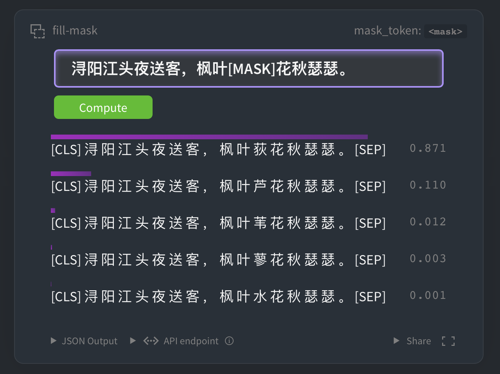

[中文说明](https://github.com/ethan-yt/guwenbert/) | [**English**](https://github.com/ethan-yt/guwenbert/blob/master/README_EN.md)

<p align="center">
    <br>
    
    <br>
</p>
<p align="center">
<a href="https://github.com/ethan-yt/guwenbert/issues"></a>
<a href="https://github.com/ethan-yt/guwenbert/stargazers"></a>
<a href="https://github.com/Ethan-yt/guwenbert/blob/main/LICENSE"></a>
</p>

`GuwenBERT`is a `RoBERTa` model trained on Classical Chinese text.

In natural language processing, pre-trained language models have become a very important basic technology. At present, there are a large number of modern Chinese BERT models available for download on the Internet, but the language model of Classical Chinese is lacking. In order to promote the research of ancient Chinese and natural language processing, we released the Classical Chinese pre-trained language model called `GuwenBERT` based on Continue Training, which combines modern Chinese RoBERTa weights and a large number of Classical Chinese corpus to transform some of the language features of modern Chinese into Classical Chinese to improve performance.

* `GuwenBERT` is based on the corpus `Daizhige Ancient Documents`, which contains 15,694 ancient Chinese books with 1.70 characters. All traditional characters are converted into simplified characters.

* `GuwenBERT`'s vocabulary is based on Classical Chinese corpus taking high-frequency characters. The vocab size is 23,292.


## Online Demo


<p align="center">
<a href="https://huggingface.co/ethanyt/guwenbert-base"></a>
</p>

Click the picture or [here](https://huggingface.co/ethanyt/guwenbert-base) to jump. The model may need to be loaded for the first time, please wait a minute.

## News
2020/10/31 CCL2020 Conference Sharing: Classical Chinese Language Model Based on Continued Training [slides](./assets/基于继续训练的古汉语语言模型.pdf)

2020/10/25 Our model has been uploaded to[Huggingface Transformers](https://github.com/huggingface/transformers), check[Instructions](#Instructions)

2020/9/29 Our model won the 2020 "Gulian Cup" Ancient Book Literature Named Entity Recognition Evaluation Contest **Second Prize**


## Instructions
### Huggingface Transformers


The following models can be easily used by [Huggingface Transformers](https://github.com/huggingface/transformers).

* **`ethanyt/guwenbert-base`**：12-layer, 768-hidden, 12-heads
* **`ethanyt/guwenbert-large`**：24-layer, 1024-hidden, 16-heads

Code: 
```python
from transformers import AutoTokenizer, AutoModel

tokenizer = AutoTokenizer.from_pretrained("ethanyt/guwenbert-base")

model = AutoModel.from_pretrained("ethanyt/guwenbert-base")
```

Note: Since this work uses Chinese corpus, RoBERTa's original Tokenizer is based on the BPE algorithm and is not friendly to Chinese, so the BERT tokenizer is used here. This configuration has been written into `config.json`, so using `AutoTokenizer` directly will automatically load `BertTokenizer`, and ʻAutoModel` will automatically load `RobertaModel`.

## Downloads

> The model we provide is the PyTorch version. If you need the tensorflow version, please use the conversion script provided by [Transformers](https://github.com/huggingface/transformers) to perform the conversion.

### Direct Download

Download directly from the official website of huggingface:

https://huggingface.co/ethanyt/guwenbert-base

https://huggingface.co/ethanyt/guwenbert-large

Drag to the bottom and click "List all files in model" → download each file in the pop-up.


### Mirrors


If users in mainland China cannot directly download the model of the huggingface hub, they can use the following mirror:

| Model | Size | Baidu Pan |
| :-----  | :-- | :------ |
| guwenbert-base | 235.2M | [Link](https://pan.baidu.com/s/1dw_08p7CVsz0jVj4jd58lQ) Password: 4jng |
| guwenbert-large | 738.1M | [Link](https://pan.baidu.com/s/1TL9mBIlIv2rSvp61xCkeJQ) Password: m5sz |


## Evaluation Results

### 2020 "Gulian Cup" Ancient Book Literature Named Entity Recognition Evaluation Contest

Second place in the competition. Detailed test results:

| NE Type    | Precision   | Recall | F1    |
|:----------:|:-----------:|:------:|:-----:|
| Book Name  | 77.50       | 73.73  | 75.57 |
| Other Name | 85.85       | 89.32  | 87.55 |
| Micro Avg. | 83.88       | 85.39  | 84.63 |


## FAQ

If you have any questions, you can leave a message directly in the Issue area, or contact me directly.
In the future, some common problems will be summarized here.

## Tips

* The initial learning rate is a critical parameter and needs to be adjusted according to the sub-task.
* For models that require CRF, please increase the learning rate of the CRF layer, generally more than 100 times that of RoBERTa.

## Pre-training Process

> Note: This section describes the pre-training process, do not refer to the configuration in this section for fine-tuning

The models are initialized with `hfl/chinese-roberta-wwm-ext` and then pre-trained with a 2-step strategy.
In the first step, the model learns MLM with only word embeddings updated during training, until convergence. In the second step, all parameters are updated during training.

<p align="center">
    <br>
    
    <br>
</p>

The detailed hyper-parameter are as follows:

| Name | Value |
|:---------|:----|
|Batch size |2,048|
|Seq Length | 512 |
|Optimizer| Adam |
|Learning Rate| 2e-4(base), 1e-4 (large) |
|Adam-eps | 1e-6 |
|Weight Decay | 0.01|
|Warmup | 5K steps, linear decay of learning rate after.| 

## References

If the content in this article is helpful to your research, welcome to refer to this work in your paper. Since our paper has not been published yet, it can be used as a footnote temporarily.

```tex
\footnote{GuwenBERT \url{https://github.com/ethan-yt/guwenbert}}.
```

## Disclaimer

The experimental results presented in the report only show the performance under a specific data set and hyperparameter combination, and cannot represent the essence of each model.
Experimental results may be changed due to random number seeds and computing equipment.
**The content in this project is for reference only for technical research, not as any conclusive basis. Users can use the model arbitrarily within the scope of the license, but we are not responsible for direct or indirect losses caused by the use of the content of the project. **

## Acknowledgment

This work is based on [中文BERT-wwm](https://github.com/ymcui/Chinese-BERT-wwm/blob/master/README.md) to continue training. 